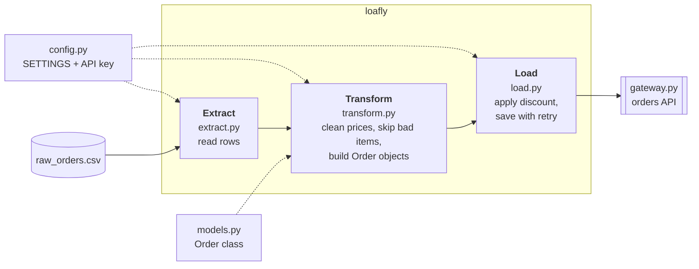

# Loafly Order Pipeline

A small, production-ready Python package for an online bakery. Every night it
reads the day's orders, cleans the prices, applies a discount, and saves each
order to the orders API. Bad rows are skipped instead of crashing the run, the
flaky API is retried, and the API key stays out of the code.
**Python standard library only.**

`Python 3.14` · `stdlib only` · `6 modules + runner` · `32 rows · 15 orders`

**🔗 Project page: https://mailtoafnk.github.io/loafly-order-pipeline/**

---

## Before and after

| Before: `legacy_orders.py` | After: `loafly/` package |
|---|---|
| Price cleaning copy-pasted inline | `clean_price()` and `apply_discount()` functions |
| Discount hard-coded as `10` in the loop | An `Order` class that owns its items and total |
| Crashes on the first blank price (order 5004) | Blank prices skipped with a WARNING, run completes |
| `print()` only, nothing saved | Timestamped logging to the terminal and `loafly.log` |
| No retry when the orders API is busy | Up to 3 save attempts, then an ERROR and move on |
| API key typed into the code | Key read with `os.getenv` from a git-ignored `.env` |

## How it runs

`run_pipeline.py` calls three stages in order:



| File | Job |
|---|---|
| `loafly/__init__.py` | Makes `loafly` a package |
| `loafly/config.py` | One `SETTINGS` dict, plus the API key read from the environment |
| `loafly/models.py` | The `Order` class: `add_item()` and `total()` |
| `loafly/extract.py` | Reads `raw_orders.csv` into a list of rows |
| `loafly/transform.py` | Cleans each price inside `try / except / else / finally` and builds `Order` objects |
| `loafly/load.py` | Applies the discount and saves each order through `gateway.py`, with retry |
| `run_pipeline.py` | Runs extract → transform → load |
| `gateway.py` | Provided orders-API client. Fails about 30% of the time. Not edited |
| `env.example` | Template for the `.env` secrets file |

## What one real run did

| Rows read | Items skipped | Orders saved | Gave up after 3 attempts |
|:---:|:---:|:---:|:---:|
| **32** | **3** (blank price) | **13 / 15** | **2** |

| Order | Customer | Total (INR, after 10% off) | Save result |
|---|---|---:|---|
| 5001 | Arjun | 297.00 | ✅ first try |
| 5002 | Kabir | 513.00 | ✅ first try |
| 5003 | Aarav | 666.00 | ❌ failed 3 times |
| 5004 | Kabir | 369.00 | 🔁 saved on retry · 1 item skipped |
| 5005 | Reyansh | 243.00 | ✅ first try |
| 5006 | Rohan | 1116.00 | ✅ first try |
| 5007 | Dev | 369.00 | ✅ first try |
| 5008 | Ishita | 639.00 | ✅ first try |
| 5009 | Saanvi | 396.00 | ✅ first try · 1 item skipped |
| 5010 | Kabir | 1467.00 | 🔁 saved on retry |
| 5011 | Rohan | 189.00 | ❌ failed 3 times |
| 5012 | Reyansh | 351.00 | 🔁 saved on retry |
| 5013 | Saanvi | 135.00 | ✅ first try · 1 item skipped |
| 5014 | Aditya | 603.00 | 🔁 saved on retry |
| 5015 | Naina | 135.00 | ✅ first try |

The API fails at random, so which orders need a retry changes on every run.
The totals and the three skipped items stay the same.

<details>
<summary>Log excerpt from that run</summary>

```text
15:12:49 | INFO    | loafly.extract   | Read 32 rows from raw_orders.csv
15:12:49 | WARNING | loafly.transform | Order 5004: skipping 'Chocolate Cake Slice' - missing or bad price ''
15:12:49 | WARNING | loafly.transform | Order 5009: skipping 'Blueberry Muffin' - missing or bad price ''
15:12:49 | WARNING | loafly.transform | Order 5013: skipping 'Cookie Box' - missing or bad price ''
15:12:49 | INFO    | loafly.transform | Checked 32 items, skipped 3, built 15 orders
15:12:49 | INFO    | loafly.load      | API key loaded from environment (ends ...3a21)
15:12:49 | WARNING | loafly.load      | Order 5003: attempt 1/3 failed - orders API unavailable for order 5003
15:12:50 | WARNING | loafly.load      | Order 5003: attempt 2/3 failed - orders API unavailable for order 5003
15:12:51 | WARNING | loafly.load      | Order 5003: attempt 3/3 failed - orders API unavailable for order 5003
15:12:51 | ERROR   | loafly.load      | Order 5003: giving up after 3 attempts
15:12:51 | WARNING | loafly.load      | Order 5004: attempt 1/3 failed - orders API unavailable for order 5004
15:12:52 | INFO    | loafly.load      | Order 5004 saved (attempt 2/3)
   ...
15:12:57 | INFO    | loafly.load      | Saved 13 orders, failed 2
15:12:57 | INFO    | loafly           | Pipeline finished
```

</details>

## Quality checklist

**Correctness**
- [x] The pipeline runs end to end: "Pipeline finished" after all 15 orders
- [x] Messy prices are cleaned: `" 1,240"` → 1240.0, `"320 "` → 320.0
- [x] Bad items are skipped, not fatal: 3 blank prices skipped, orders 5004, 5009 and 5013 still saved
- [x] Orders are saved with retry: 13 of 15 saved, 4 needed a second attempt

**Structure**
- [x] Clean, reusable functions: one `clean_price()` for every price; `apply_discount(price, percent)`
- [x] An `Order` class holds data and actions: `add_item()` and `total()`, no inline summing
- [x] A real package with one job per module: `loafly/__init__.py` + config, models, extract, transform, load; runner outside
- [x] Config-driven, no magic numbers: changing the discount from 10 to 20 in `config.py` alone turns order 5001 from 297.00 into 264.00 INR

**Robustness**
- [x] Logging at the right level: INFO for progress, WARNING for skips and failed attempts, ERROR for giving up
- [x] Timestamped and saved to a file: every line goes to the terminal and `loafly.log`; no `print` left
- [x] Exception handling around price parsing: `try / except / else / finally` catching `ValueError`, `TypeError`, `AttributeError`
- [x] A working retry: up to 3 attempts, 1 second apart, then an ERROR and move on

**Safety**
- [x] Secret read from the environment: `os.getenv("LOAFLY_API_KEY")`; only the last 4 characters are logged
- [x] Secret never in the code or in git: `.gitignore` excludes `.env` and the old script that held the key
- [x] Safe template committed instead: `env.example` holds a placeholder value only
- [x] Reproducible setup: `requirements.txt` (stdlib only) and the setup steps below

## Setup

1. Create and activate a virtual environment:

   ```bash
   # Windows
   python -m venv .venv
   .venv\Scripts\activate

   # Mac / Linux
   python3 -m venv .venv
   source .venv/bin/activate
   ```

2. Install requirements (standard library only, so this installs nothing):

   ```bash
   pip install -r requirements.txt
   ```

3. Create your secrets file from the template and set the real key:

   ```bash
   copy env.example .env      # Windows
   cp env.example .env        # Mac / Linux
   ```

   `.env` is git-ignored and must never be committed.

## Run

```bash
python run_pipeline.py
```

Logs are printed to the terminal and written to `loafly.log`.

## Design decisions

- **Catching `ValueError`, not just `TypeError`.** A blank CSV cell arrives as
  `""`, and `float("")` raises `ValueError`. Catching only `TypeError` and
  `AttributeError` would still crash, so all three are caught.
- **`finally` counts every row.** The `finally` block runs for good and bad rows
  alike, which is how the log can report "Checked 32 items" alongside
  "skipped 3".
- **Retry without a wasted wait.** Each failure logs a WARNING and waits
  `retry_wait_seconds`, except after the last attempt. Giving up is an ERROR,
  and the loop moves on to the next order.
- **A 10-line `.env` reader.** With no third-party packages allowed,
  `config.py` copies `KEY=value` lines from `.env` into the environment, then
  `os.getenv` reads the key. Only its last 4 characters are ever logged.
- **Config-driven.** Every setting (currency, discount, input file, retries,
  wait time, log file) lives in `SETTINGS` in `config.py`. Change it there and
  behaviour changes without touching other files.
